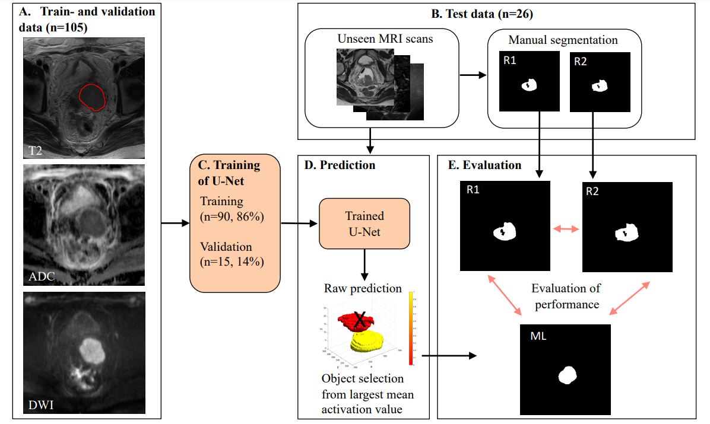

#### <b>[Update November 2022]</b> This source code has been updated to work with current version of [fastMONAI](https://github.com/MMIV-ML/fastMONAI) 

Fully automatic whole-volume tumor segmentation in cervical cancer
==============================


Project Organization
--------
    ├── figs            <- Generated figures
    │      
    ├── notebooks       <- Tutorial-like Jupyter notebook 
    │
    ├── src             <- Source code for use in this project
    │
    ├── .ignore         <- Local files and folder to be ignored  
    │
    ├── README.md       <- The top-level README for developers using this project 
    │
    └── environment.yml <- Config for conda, mamba and pip

--------
Setup
--------
Run the following command to create a new conda environment from yml file:
```
conda env create --file environment.yml
conda activate cc-seg
```
<b>[Optional]</b> Run the following command with your conda environment activated: 
```
conda env update --file environment.yml
```

<b>[Note]</b> If conda environment is not showing as a kernel in Jupyter Notebook run the following line:
```
python -m ipykernel install --user --name <ENVIRONMENT> --display-name "Python (cc-seg)"
```
